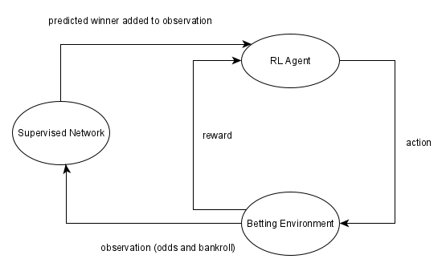
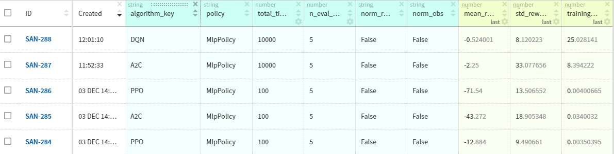
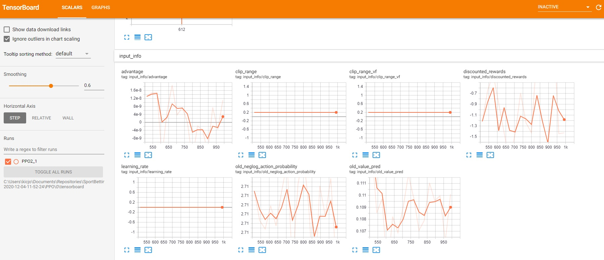
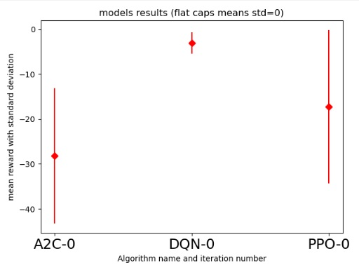

# Reinforcement Learning for Sports betting

<p align="center">
  <i>How I discovered that I won't be a milioner that easily</i>
  <br/>
 
</p>


## What is it about?

Using the library [Stable-Baselines](https://github.com/hill-a/stable-baselines) and data football [Beat The Bookie: Odds Series Football Dataset](https://www.kaggle.com/austro/beat-the-bookie-worldwide-football-dataset?select=odds_series_b_matches.csv.gz) this was an attempt to let agent learn how to bet win in a long run.

<details><summary>SPOILER ALERT!</summary>
<p>
<i>I'm still poor </i>
</p>
</details>

## Which part of the data did I use?

Only average odds at closing time were used. 

## What does observation look like?

Average odds at closing time and current bankroll. I also added wrapper that adds predictions on winner (given odds) using tiny, classical supervised network on different dataset but still let RL agent make decision what and how much to bet.



Therefore state representation eventually became a vector of 7 numbers:
 * normalized bankroll (how close to losing agent is)
 * bookies odds for home team, away team and draw (normalized or not)
 * chances of each outcome according to my supervised network (this is not the best model - only 0.44 F1 score on the same dataset)  

## Environment

Environment (located in `betting_env/environment/betting_environment.py`) implements [OpenAI gym](https://gym.openai.com/docs/) interface. Environment accepts only discrete actions defined as in `betting_env/environment/actions.py`.
Epoch ends when either winning limit is reached (for instance double of initial bankroll) or when all the matches from dataset has been played (hasn't happen).

Wrappers for state normalization and keras model are in the same folder.
It even has tests in `tests/betting_env_tests`!

## Metrics

To compare results I used [Neptune.AI](https://neptune.ai/) console (it's free and fun) for single number comparison in addition to good old error bars, tensorboard and bunch of txt file.

##### Neptune.ai console
<p align="center">

<br/>
</p>


##### Tensorboard

<p align="center">

<br/>
</p>

##### Text output

```
'all algoritms and hyperparameters to be tested:'
{'A2C': [{'lr_schedule': 'linear', 'policy': 'MlpPolicy'}],
 'DQN': [{'policy': 'MlpPolicy'}],
 'PPO': [{'policy': 'MlpPolicy'}]}
https://ui.neptune.ai/asdd/sandbox/e/SAN-290
Algorithm: A2C
Hyperparamters: {'policy': 'MlpPolicy', 'lr_schedule': 'linear'}

Eval num_timesteps=200, episode_reward=-20.24 +/- 32.30
Episode length: 100.00 +/- 0.00
New best mean reward!
Eval num_timesteps=400, episode_reward=-36.34 +/- 30.92
Episode length: 100.00 +/- 0.00
...
```
##### Error bar

<p align="center">

<br/>
</p>

## Example parameters
```
--algorithms
PPO
A2C
DQN
--render_test
False
--video_record_test
False
--episode_max_steps
100
--total_timesteps
1000
--verbose
False
--norm_obs
False
--norm_reward
False
--neptune_api_token
<<YOUR NEPTUNE API TOKEN, IT'S FREE!>> 
```
To learn more visit `main.py`

# Customisation

### Other environments
It's (relatively) easy to use this for other simple environments. Substitute  `exp.betting_env_creator.get_env_function` with your function that follows the same interface.
 
``` python
import gym
def get_my_custom_env():
    def make_env(g=10):

        env = gym.make('Pendulum-v0', g=g)
        return env

    #they have to match paramters of make_env function
    train_env_parameters_dict = {"g": 10} # train on earth
    eval_env_parameters_dict = {"g": 24} # lets evaluate it on Jupiter!
    test_env_parameters_dict = {"g": 10}

    return (
        make_env, #function that returns gym.Env instance
        "Pendulum-v0", #string name of this environment for logging purpouse
        train_env_parameters_dict, # dictionary of parameters to be passed to make_env function when creating train set
        eval_env_parameters_dict, # dictionary of parameters to be passed to make_env function when creating eval set
        test_env_parameters_dict,# dictionary of parameters to be passed to make_env function when creating test set
    )
```


### Setting algorithm hyperparamters for grid search

Because I expect to be the only user of this code, I decided to keep grid search parameters in code instead of parsing a yaml or json file:
Just change values in  `exp.algorithm_registry.A2C_hyperparameters` to create grid search for A2C algorithm, `exp.algorithm_registry.PPO_hyperparameters` for PPO etc.

```python
def A2C_hyperparameters():

    return {
        'policy': ["MlpPolicy"],
        'lr_schedule': ["linear", 'constant'],
         'gamma': [0.9,0.9999],
    }
```
Changing function `A2C_hyperparameters` to match the one above and setting `--algorithms` parameter to `A2C`  will produce following grid search:
```
'all algoritms and hyperparameters to be tested:'
{'A2C': [{'gamma': 0.9, 'lr_schedule': 'linear', 'policy': 'MlpPolicy'},
         {'gamma': 0.9999, 'lr_schedule': 'linear', 'policy': 'MlpPolicy'},
         {'gamma': 0.9, 'lr_schedule': 'constant', 'policy': 'MlpPolicy'},
         {'gamma': 0.9999, 'lr_schedule': 'constant', 'policy': 'MlpPolicy'}],
```


